# DreamOSatSatellites

Enigma2 için SatBeams / KingOfSat kaynaklarından satellites.xml oluşturucu.
By audi06_19 — info@dreamosat-forum.com

Kumandanızla kaynak seçin, istediğiniz uyduları işaretleyin ve güncel frekanslardan `satellites.xml` oluşturun. Seçimlerinizi beş ayrı profilde saklayabilir, bölgesel toplu seçim yapabilir ve ekran boyutunu ayarlayabilirsiniz.

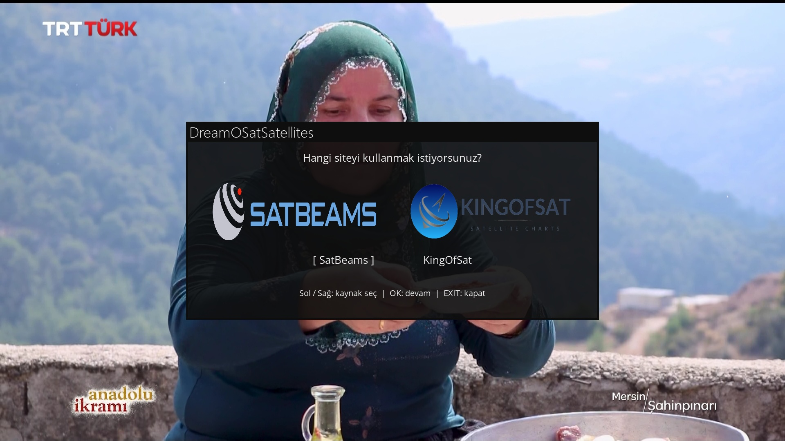

## Kurulum

`src/DreamOSatSatellites` klasörünü `/usr/lib/enigma2/python/Plugins/Extensions/` içine kopyalayın ve Enigma2 arayüzünü yeniden başlatın. Eski `SatBeamsSatellites` klasörünü Extensions dışına yedekleyin; iki kopyayı birlikte çalıştırmayın.

## Kullanım

- Açılışta logolu kaynak seçimi.
- OK: seç/kaldır; yeşil: tümünü seç; sarı: tümünü kaldır; mavi: XML oluştur.
- MENU: kaynak bazında beş profil, bölgesel seçim, HD/FHD/4K ve Hakkında.
- Mevcut `/etc/tuxbox/satellites.xml` zaman damgasıyla yedeklenir.
- SatBeams sorgusu `rounded_pos`, XML konumu `real_pos` kullanır.
- KingOfSat nominal konum kullanır; açıkça boş sonuç dönen konumlar atlanır.

OpenATV ve Dreambox Two Gemini 4.2 üzerinde geliştirilmiştir. Python 2.7 ve Python 3 uyumluluğu hedeflenir. Bölgesel seçimler yörünge aralıklarına dayanır.

## Dil desteği

Cihazın dili otomatik kullanılır. Türkçe ve İngilizce çeviriler `src/DreamOSatSatellites/locale/` altındadır. Yeni dil için `.pot` şablonunu kullanın. `.po` değişikliklerinden sonra `python3 tools/compile_translations.py` çalıştırın. Derlenmiş `.mo` dosyaları da kuruluma dahildir.

## Cihazdan ekran görüntüleri

Görseller doğrudan cihazdan alınmıştır. Görünüm kullanılan imaj ve skin'e, uydu ve frekans sayıları ise kaynak verilerine göre değişebilir.

### Uydu seçimi

SatBeams listesinden uyduları tek tek seçin veya KingOfSat ile toplu seçim yapın.

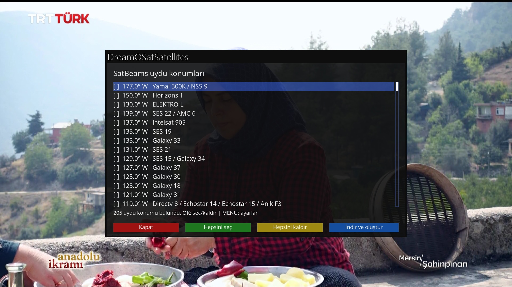
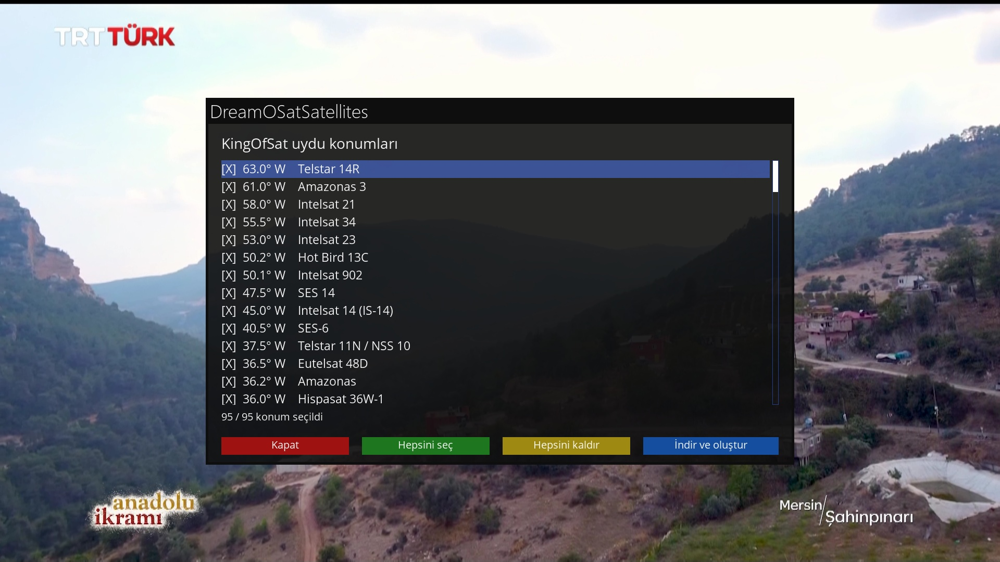

### Menü ve profiller

MENU tuşuyla ayarlara ulaşın. Profil 1–5 arasında seçim yaparak işaretlediğiniz uyduları kaydedin veya kayıtlı seçimi yükleyin.

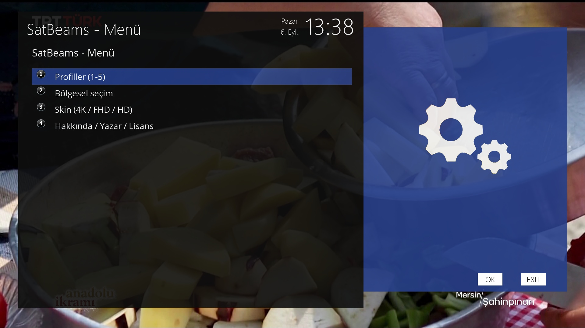
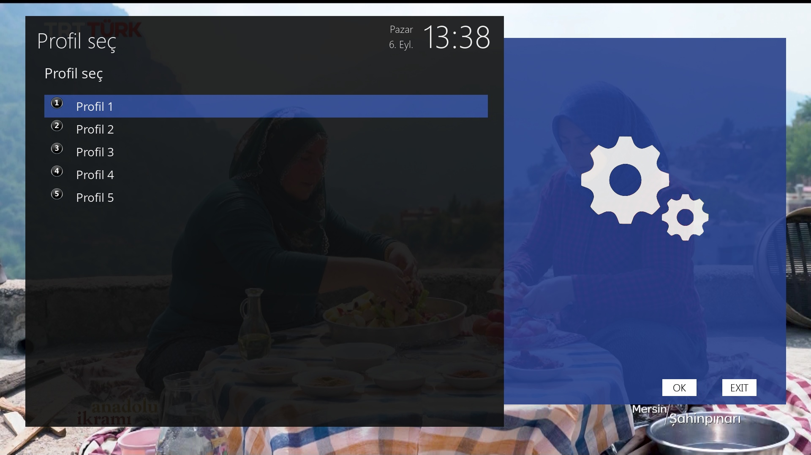
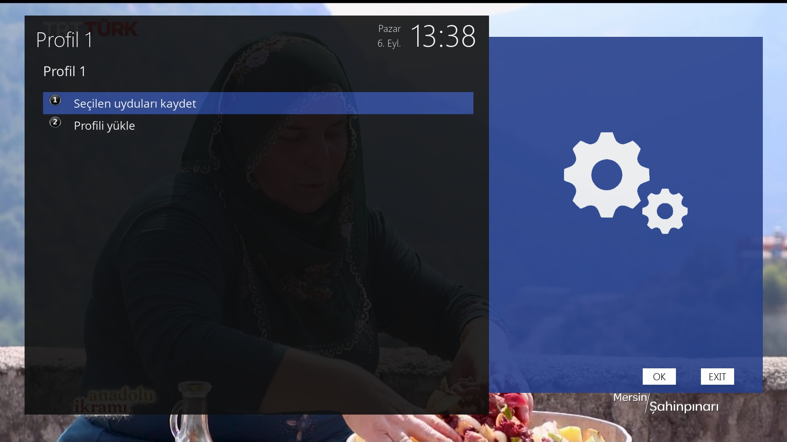

### Bölgesel seçim ve ekran boyutu

Europe, Atlantic, America ve Asia seçenekleri ilgili yörünge aralıklarını mevcut seçiminize ekler. Ekran boyutu için 4K, FHD veya HD seçilebilir.

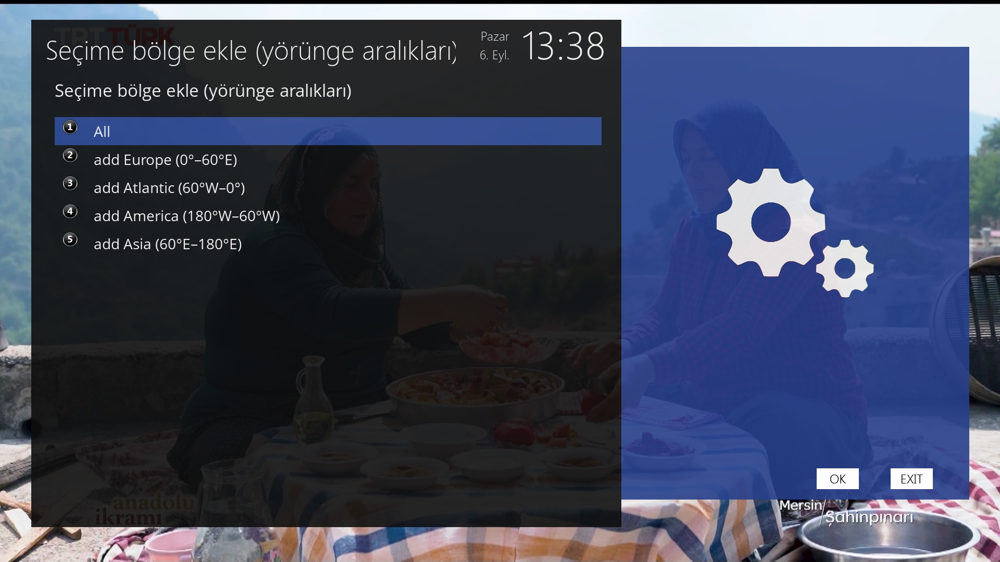
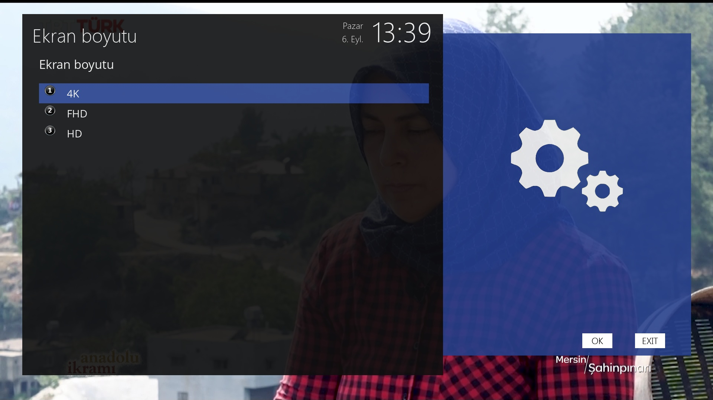

### XML oluşturma ve sonuç

İşlem öncesinde onay istenir. Mevcut XML yedeklenir; sonuç ekranında yazılan uydu/transponder sayıları, yedek yolu ve boş olduğu için atlanan konumlar gösterilir. Aşağıdaki sayılar bu örnek çalıştırmaya aittir.

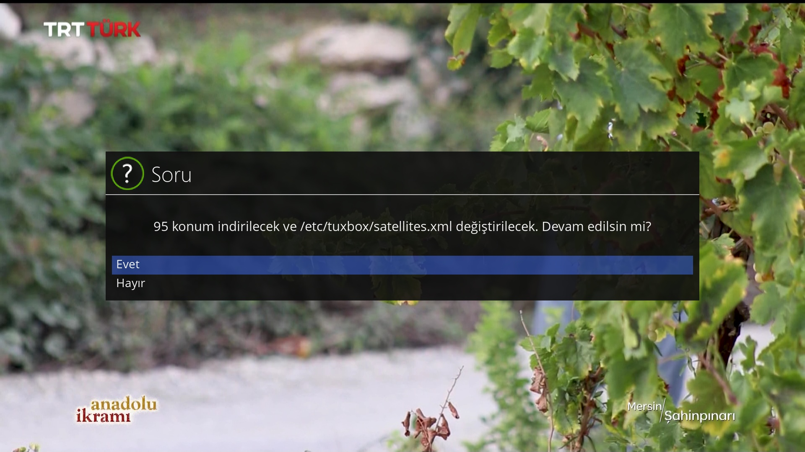
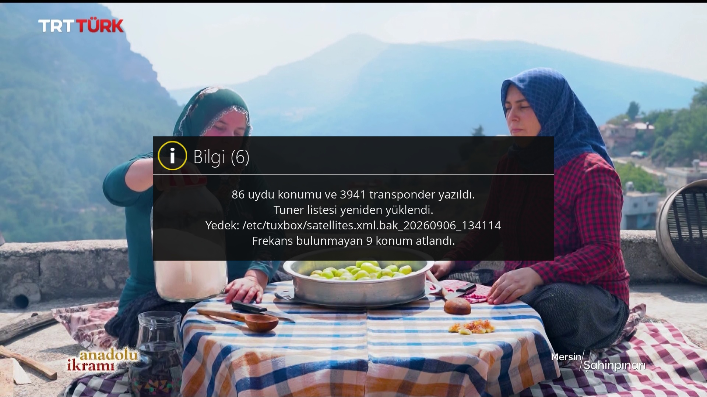

### Hakkında

Yazar, destek forumu, lisans ve veri kaynakları bilgileri eklenti içinden görüntülenebilir.

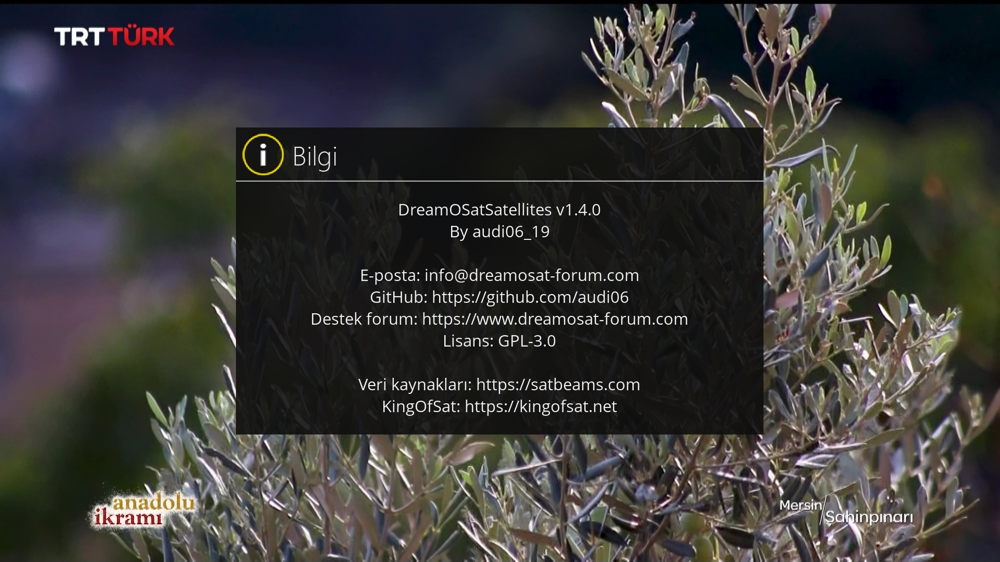

## Lisans ve iletişim

GPL-3.0-only. Tam metin: [LICENSE](LICENSE); kapsam: [LICENSING.md](LICENSING.md).
Logolar ve üçüncü taraf verileri ilgili sahiplerinin koşullarına tabidir.

- Destek: https://www.dreamosat-forum.com
- GitHub: https://github.com/audi06/DreamOSatSatellites
- Kaynaklar: https://satbeams.com ve https://kingofsat.net

